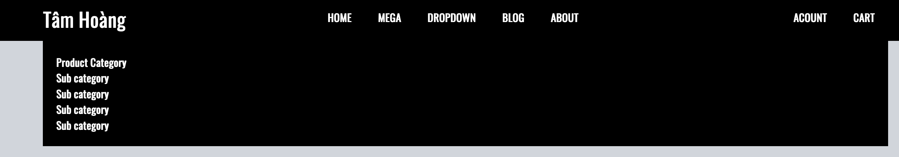
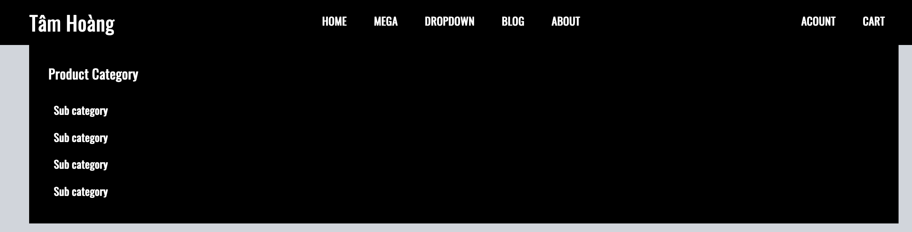
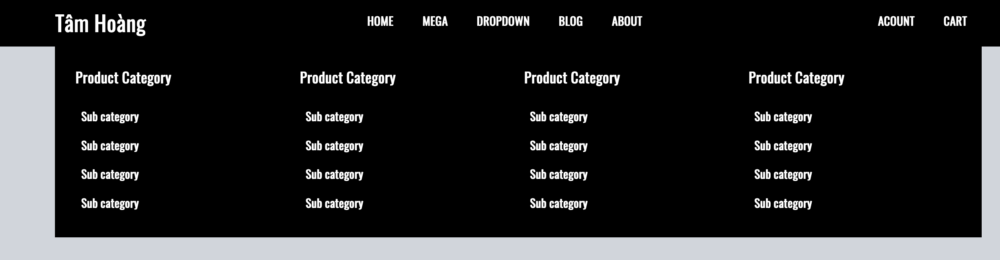
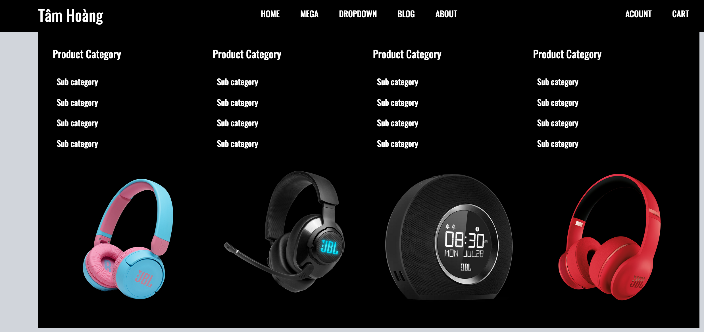
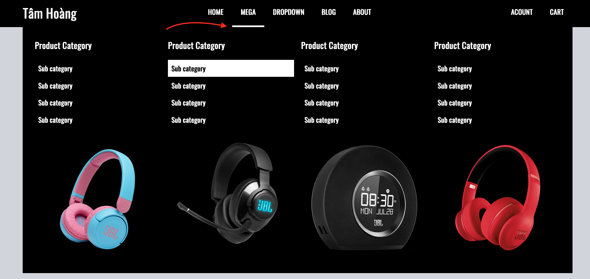
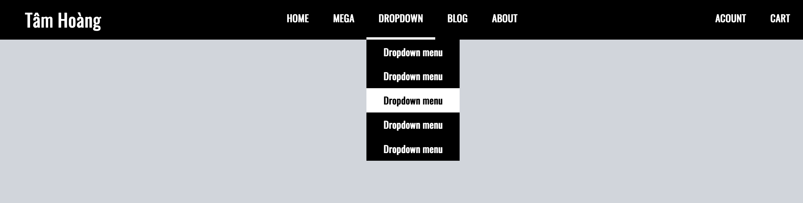
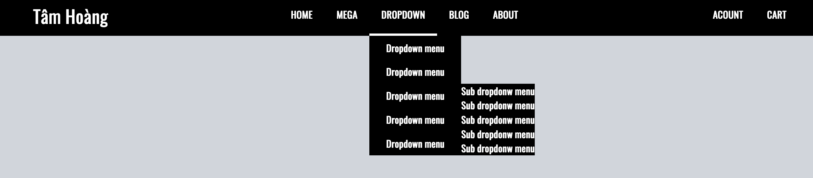
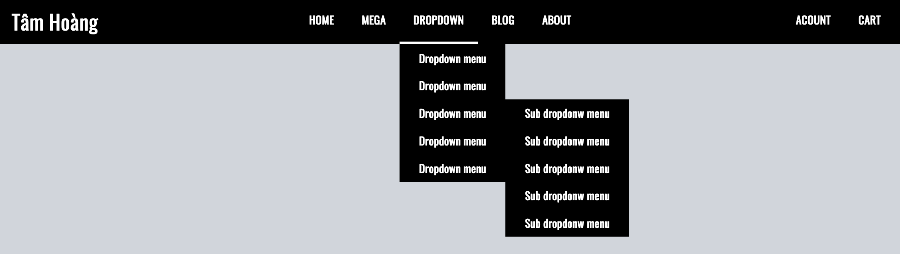

# Mega menu

## 1. Cài đặt

### 1. Cài đặt chung

1. Tạo thư mục project

```
Mega-menu
  static
  tailwind
  README.MD
```

2. Chạy lệnh cài đặt tailwind

```
npx tailwindcss-cli@latest init
```

3. Config file tailwind.config.js

```
variants: {
    extend: {
      display: ["group-hover"],
      margin: ["group-hover"],
      visibility: ["group-hover"],
    },
  },
```

4. Tạo file tailwind.custom.css trong folder tailwind

```
@tailwind base;
@tailwind components;
@tailwind utilities;
```

5. Build file tailwind.css

```
npx tailwindcss-cli@latest build tailwind.custom.css -c tailwind.config.js -o ../static/tailwind.css
```

### 2. Cài đặt google font

1. lên trang fonts.google.com chọn font mà mình cần

2. Copy link font và bỏ vào file index.html

```html
<link rel="preconnect" href="https://fonts.gstatic.com" />
<link
  href="https://fonts.googleapis.com/css2?family=Oswald&display=swap"
  rel="stylesheet"
/>
```

3. Config lại file tailwind.config.js

```js
module.exports = {
  theme: {
    extend: {
      fontFamily: {
        sans: ["Oswald", "sans-serif"],
      },
    },
  },
};
```

4. Chạy lệnh build lại file tailwind

```bash
npx tailwindcss-cli@latest build tailwind.custom.css -c tailwind.config.js -o ../static/tailwind.css
```

5. Dùng class font-sans tại thẻ body

```html
<body class="h-screen bg-gray-300 font-sans"></body>
```

## 2. Cài đặt khung sườn ban đầu của menu

### 1. HTML

```html
<body class="h-screen bg-gray-300 font-sans">
  <nav>
    <div>
      <a href="#">Tâm Hoàng</a>
      <ul>
        <li><a href="#">HOME</a></li>
        <li><a href="#">MEGA</a></li>
        <li><a href="#">DROPDOWN</a></li>
        <li><a href="#">BLOG</a></li>
        <li><a href="#">ABOUT</a></li>
      </ul>
      <ul>
        <li><a href="#">ACOUNT</a></li>
        <li><a href="#">CART</a></li>
      </ul>
    </div>
  </nav>
</body>
```

### 2. Class cho thẻ nav

```html
<nav class="bg-black text-white"></nav>
```

Nền đen, chữ trắng


### 3. Class cho thẻ chứa toàn bộ menu

- Flex, và căn giữa các item bên trong theo 2 trục xy
- Bản thân container cũng được căn giữa theo trục x


```html
<div
  class="
flex justify-between items-center 

max-w-7xl 
mx-auto 

relative
"
></div>
```

```css
.max-w-7xl {
  max-width: 80rem;
}
```

### 4. Class cho thẻ a


```html
<a href="#" class="font-bold text-3xl">Tâm Hoàng</a>
```

```css
.text-3xl {
  font-size: 1.875rem;
  line-height: 2.25rem;
}
.font-bold {
  font-weight: 700;
}
```

### 5. Class cho 2 thẻ ul chứa list item menu

- Dùng flex để các list item menu nằm ngang hàng nhau
  

```html
<ul class="flex font-semibold"></ul>
```

### 6. Tạo layer component trong tailwind để tái sử dụng được cho nhiều list item menu

1. Sửa File tailwind.custom.css

```
tailwind
  tailwind.custom.css
```

2. CSS

```css
@layer components {
  .menu-item {
    @apply p-5 inline-block border-b-4 border-black hover:border-white;
  }
}
```

3. Rebuild lại file taiwind.css

```terminal
npx tailwindcss-cli@latest build tailwind.custom.css -c tailwind.config.js -o ../static/tailwind.css
```

4. Dùng class menu-item cho các thẻ a

```html
<ul class="flex font-semibold">
  <li><a href="#" class="menu-item">HOME</a></li>
  <li><a href="#" class="menu-item">MEGA</a></li>
  <li><a href="#" class="menu-item">DROPDOWN</a></li>
  <li><a href="#" class="menu-item">BLOG</a></li>
  <li><a href="#" class="menu-item">ABOUT</a></li>
</ul>
```

## 3. Tạo mega menu khi hover vào menu-item có text là MEGA


```html
<li>
  <a href="#" class="menu-item">MEGA</a>
  <!-- MEGA MENU  -->
  <div>
    <ul>
      <li><a href="#">Product Category</a></li>
      <li><a href="#">Sub category</a></li>
      <li><a href="#">Sub category</a></li>
      <li><a href="#">Sub category</a></li>
      <li><a href="#">Sub category</a></li>
    </ul>
  </div>
</li>
```

### 1. Class cho thẻ div bao chứa mega menu

- Kích thước 100% chiều rộng
- Layout chia 4 cột, dùng thuộc tính grid
- Là 1 lớp layer mới, dùng thuộc tính absolute đề điều khiển vị trí hiển thị bằng thuộc tính top, left
  

Chú ý: top và left của thẻ div này, đang là phụ thuộc vào div bao toàn bộ menu (vì nó là thẻ gần nhất có thuộc tính display relative) (Phần 1.2)

```html
<div
  class="
  absolute top-full left-0 
  grid grid-cols-4

  p-5 
  w-full 
  bg-black
  "
></div>
```

```css
.grid {
  display: grid;
}
.grid-cols-4 {
  grid-template-columns: repeat(4, minmax(0, 1fr));
}

.absolute {
  position: absolute;
}
.top-full {
  top: 100%;
}
.left-0 {
  left: 0px;
}

.w-full {
  width: 100%;
}
.p-5 {
  padding: 1.25rem;
}
```

### 2. Class cho thẻ ul

- Một chút padding (8px)

```html
<ul class="p-2"></ul>
```

```css
.p-2 {
  padding: 0.5rem;
}
```

### 3. CSS cho 1 menu trong menu mega



#### 1. Tạo class mega-sub-item @layer components cho menu item của mega

Trong Mega menu này, mỗi menu sẽ có 1 phần, 1 lần Tiêu đề của menu, và các list item

1. Sửa trong file tailwind.custom.css

```css
@layer components {
  .mega-sub-item {
    @apply block p-2 hover:bg-white hover:text-black cursor-pointer;
  }
  .mega-sub-item-title {
    @apply block font-semibold text-xl mb-5;
  }
}
```

2. Rebuild lại tailwind.css

#### 2. Dùng class cho tiêu đề, và các menu con trong 1 menu mega

```html
<ul class="p-2">
  <li><a href="#" class="mega-sub-item-title">Product Category</a></li>
  <li><a href="#" class="mega-sub-item">Sub category</a></li>
  <li><a href="#" class="mega-sub-item">Sub category</a></li>
  <li><a href="#" class="mega-sub-item">Sub category</a></li>
  <li><a href="#" class="mega-sub-item">Sub category</a></li>
</ul>
```

### 4. Nhân bản 1 menu thành 4 menu con trong menu mega



### 5. Thêm 4 thẻ image

- Nhờ thuộc tính grid đã sử dụng ở thẻ cha container, nền 4 ảnh sẽ chia đều vào 4 cột
  

### 6. Tạo hiệu ứng

#### 1. Cho toàn bộ mega menu lên trên 1 chút, và ẩn đi

```html
<div
  class="grid grid-cols-4 w-full p-5 absolute top-full left-0 bg-black 
  
  mt-14 opacity-0 invisible"
></div>
```

#### 2. Cho thẻ li, cái mà bao ngoài mega menu 1 class tên là group

Đây là cách viết css của tailwind khi muốn thực hiện hover vào 1 thẻ cha, mà thẻ con sẽ được áp dụng hiệu ứng

```html
<li
  class="group

"
>
  <a href="#" class="menu-item">MEGA</a>
</li>
```

#### 3. Cho thẻ bao mega menu có class group-hover và các hiệu ứng

- chạy xuống dưới, mượt mà trong 300ms

```html
<div
  class="grid grid-cols-4 w-full p-5 absolute top-full left-0 bg-black -mt-0.5 opacity-0 invisible
   
   group-hover:opacity-100 group-hover:visible group-hover:mt-0 
   
   transition-all duration-500"
></div>
```

#### 4. Khi user hover trong sub menu, thì thẻ a menu item Mega vẫn có border-white



```html
<li class="group">
  <a href="#" class="menu-item group-hover:border-white">MEGA</a>
</li>
```

```css
.group:hover .group-hover\:border-white {
  --tw-border-opacity: 1;
  border-color: rgba(255, 255, 255, var(--tw-border-opacity));
}
```

## 4. DROPDOWN MENU

Dropdown menu nghĩa là, có 1 thẻ li>a

Bên trong thẻ này, lại có 1 menu nữa (gọi là dropdown content)

Khi hover vào item dropdown, sẽ hiện ra danh sách menu thứ 2.

```html
<li>
  <a href="#" class="menu-item">DROPDOWN</a>
  <!-- Dropdown menu content  -->

  <!-- End Dropdown menu content  -->
</li>
```

Các bước thực hiện:

### 1. Tạo menu con

```html
<!-- Dropdown menu content  -->
<ul>
  <li><a href="#">Dropdown menu</a></li>
  <li><a href="#">Dropdown menu</a></li>
  <li><a href="#">Dropdown menu</a></li>
  <li><a href="#">Dropdown menu</a></li>
  <li><a href="#">Dropdown menu</a></li>
</ul>

<!-- End Dropdown menu content  -->
```

### 2. Cho thẻ li có class group và relative

- group là tên class mặc định của tailwind nhằm áp dụng pseudo hover lên li
- relative là thuộc tính css giúp chỉ định ra điểm top-left-right-bottom của item con (ul có thuộc tính position absolute)

```html
<li class="relative group">
  <a href="#" class="menu-item group-hover:border-white">DROPDOWN</a>
  <!-- Dropdown menu content  -->
  <ul class="absolute left-0 bg-black w-max">
    <li><a href="#">Dropdown menu</a></li>
    <li><a href="#">Dropdown menu</a></li>
    <li><a href="#">Dropdown menu</a></li>
    <li><a href="#">Dropdown menu</a></li>
    <li><a href="#">Dropdown menu</a></li>
  </ul>
  <!-- End Dropdown menu content  -->
</li>
```

### 3. Tạo hiệu ứng khi hover vào Dropdown thì xuất hiện Dropdown content (giống với mega menu)

### 4. Css cho từng menu item bên trong dropdown content

#### 1. @layer components cho class tên là menu-sub-item

#### 2. Rebuild tailwind.css

#### 3. Sử dụng class menu-sub-item



### 5. Tạo thêm 1 sub dropdown menu trong dropdown content menu

#### 1. Tạo ul mới trong thẻ li > a

```html
<li class="relative">
  <a href="#" class="menu-sub-item">Dropdown menu</a>
  <!-- SUB DROPDOWN MENU  -->
  <ul class="absolute left-full top-full bg-black w-max">
    <li><a href="#">Sub dropdonw menu</a></li>
    <li><a href="#">Sub dropdonw menu</a></li>
    <li><a href="#">Sub dropdonw menu</a></li>
    <li><a href="#">Sub dropdonw menu</a></li>
    <li><a href="#">Sub dropdonw menu</a></li>
  </ul>
  <!-- END SUB DROPDOWN MENU  -->
</li>
```

#### 2. Chỉ định vị trí hiển thị của sub dropdown menu

- Cho li chứa ul là relative;
- ul là absolute
  Lúc này, vị trí ul sẽ phụ thuộc vào vị trí của li
- left-full: ul sẽ nằm ngoài cùng bên phải của li
- top-full: ul sẽ nằm dưới cùng của li
  

#### 3. Dùng class menu-sub-item để style cho các item a bên trong ul



```html
<ul class="absolute left-full top-full bg-black w-max">
  <li><a href="#" class="menu-sub-item">Sub dropdonw menu</a></li>
  <li><a href="#" class="menu-sub-item">Sub dropdonw menu</a></li>
  <li><a href="#" class="menu-sub-item">Sub dropdonw menu</a></li>
  <li><a href="#" class="menu-sub-item">Sub dropdonw menu</a></li>
  <li><a href="#" class="menu-sub-item">Sub dropdonw menu</a></li>
</ul>
```

#### 4. Hiệu ứng của sub dropdown menu

- Mặc định là ẩn
- Khi hover vào thẻ cha thì sub dropdown menu sẽ hiện ra mượt mà trong 300s

Tailwind hỗ trợ 2 class để làm hiệu ứng hover trong css tuy nhiên nó chỉ được 1 level, sang level thứ 2, thì không được.

Do đó, sẽ đi tạo 1 hover khác trong @layer utilites giống như code css thuần

```css
@layer utilities {
  .sub-dropdown:hover > .sub-dropdown-content {
    opacity: 1;
    visibility: visible;
    left: 100%;
  }
}
```

Rebuild lại file tailwind.css

Dùng class sub-dropdown cho thẻ li

Dùng class sub-dropdown-content cho thẻ ul

## 5. Xuất bản dạng production, tailwind css sẽ chỉ build những class có sử dụng trong file html

1. Đặt biến môi trường production

```terminal
NODE_ENV='production'
```

2. Sửa lại key purge trong file tailwind.config.js

```js
purge: {
    enabled: true,
    content: ["../*.html"],
  },
```

3. Rebuild lại file tailwind.min.css
